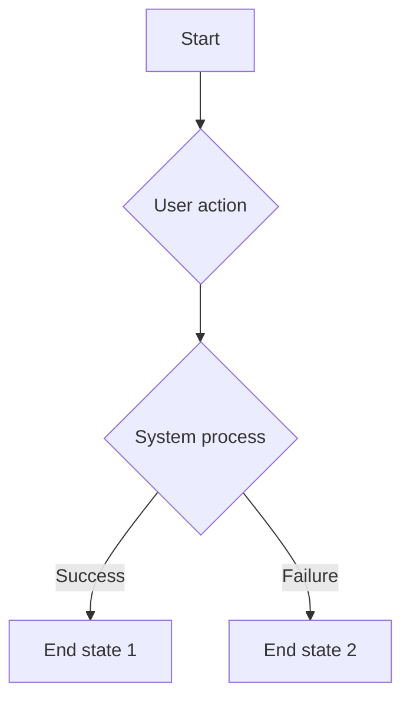

# Technical Requirement Document (TRD) - [Feature Name]

## 1. Introduction

> **Guideline:** Provide a brief, high-level overview of the feature. Describe its purpose, the problem it solves, and its intended audience. This section should set the context for the rest of the document.

This document outlines the technical requirements for implementing the [Feature Name] screen based on the Figma design. It covers UI components, their properties, user interactions, and state management.

## 2. UI Components

> **Guideline:** List all UI components identified in the Figma design. For each component, specify its name, Figma component ID (if available), type (e.g., INSTANCE, FRAME), key properties (e.g., color, size, text), and a unique `Test ID` for QA automation. This creates a clear inventory for developers and testers.

| Component Name | Figma Component ID | Type | Properties | Test ID |
| :--- | :--- | :--- | :--- | :--- |
| **[Component 1]** | `[ID]` | `[Type]` | `[Property1]`, `[Property2]` | `[test_id_1]` |
| **[Component 2]** | `[ID]` | `[Type]` | `[Property1]`, `[Property2]` | `[test_id_2]` |
| **[Component 3]** | `[ID]` | `[Type]` | `[Property1]`, `[Property2]` | `[test_id_3]` |

## 3. User Interactions and Screen States

> **Guideline:** Detail how the user interacts with the UI and how the screen responds. Describe all possible states for each component (e.g., default, focused, error, disabled). This section is crucial for defining the feature's dynamic behavior.

### 3.1. [Interaction/State Group 1]

-   **[State/Action 1]:** [Description of the state or action and the expected outcome.]
-   **[State/Action 2]:** [Description of the state or action and the expected outcome.]

### 3.2. [Interaction/State Group 2]

-   **[State/Action 1]:** [Description of the state or action and the expected outcome.]
-   **[State/Action 2]:** [Description of the state or action and the expected outcome.]

## 4. Data Flow

> **Guideline:** Describe how data moves through the system for this feature. Detail user input, state management (e.g., ViewModel, Redux), API calls (including request/response formats), and how the UI updates based on data changes.

1.  **User Input:** [Describe how user input is captured.]
2.  **State Management:** [Explain the state management approach.]
3.  **API Call(s):** [Detail the API endpoints, methods, and payloads.]
4.  **API Response:** [Describe how success and failure responses are handled.]

## 5. Mermaid Diagram - [Feature Name] Flow

> **Guideline:** Create a Mermaid diagram to visually represent the user flow or data flow. This helps stakeholders quickly understand complex processes and decision points.

## 6. Complexity Assessment ([Persona])

> **Guideline:** Assess the feature's complexity from a specific persona's perspective (e.g., Mobile Engineer, Backend Engineer). Rate each category on a scale of 1-10 using the rubric below, and calculate the average to determine the overall complexity. This helps in effort estimation and resource allocation.

### Complexity Rubric
-   **Number of steps:** How many distinct operations are required?
    -   *1-3 steps:* Low complexity (1-3)
    -   *4-7 steps:* Medium complexity (4-7)
    -   *8+ steps:* High complexity (8-10)
-   **Interdependencies:** How interconnected are the different parts?
    -   *Few dependencies:* Low complexity (1-3)
    -   *Some dependencies:* Medium complexity (4-7)
    -   *Many complex dependencies:* High complexity (8-10)
-   **Conditional logic:** How much branching and decision-making is needed?
    -   *Linear process:* Low complexity (1-3)
    -   *Some branching:* Medium complexity (4-7)
    -   *Complex decision trees:* High complexity (8-10)
-   **Domain knowledge:** How specialized is the knowledge required?
    -   *General knowledge:* Low complexity (1-3)
    -   *Some specialized knowledge:* Medium complexity (4-7)
    -   *Deep expertise in multiple domains:* High complexity (8-10)

### Assessment Table
| Category | Assessment | Score (1-10) |
| :--- | :--- | :--- |
| **Number of Steps** | [Assess the number of distinct operations required.] | |
| **Interdependencies** | [Assess how interconnected the different parts are.] | |
| **Conditional Logic** | [Assess the amount of branching and decision-making needed.] | |
| **Domain Knowledge** | [Assess the level of specialized knowledge required.] | |
| **Average Score** | | |

**Overall Complexity:** [Describe the overall complexity based on the average score (e.g., Low, Medium, High).]