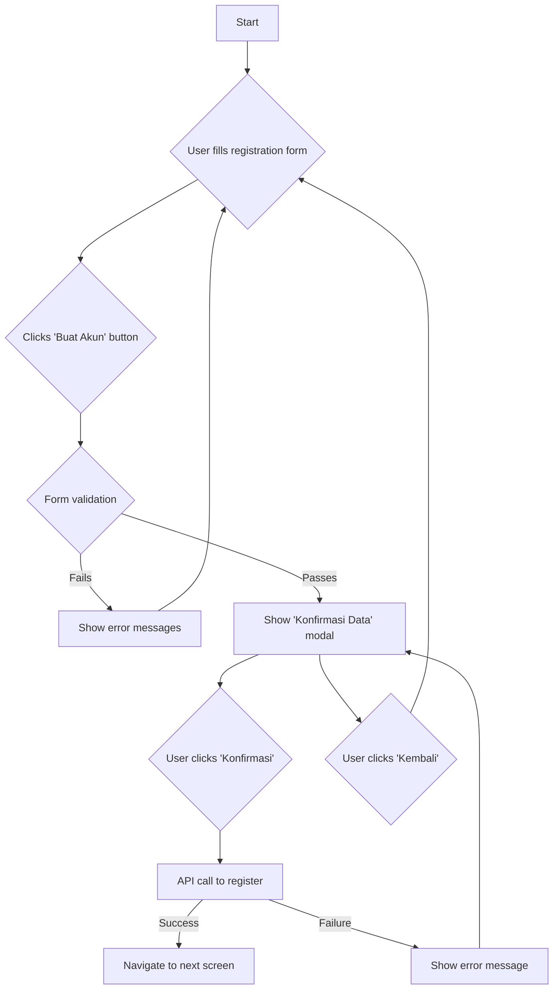

# Technical Requirement Document (TRD) - User Registration Screen

## 1. Introduction

This document outlines the technical requirements for implementing the User Registration screen based on the Figma design. It covers UI components, their properties, user interactions, and state management.

## 2. UI Components

The following table details the UI components, their properties, and corresponding component names from the Figma file.

| Component Name | Figma Component ID | Type | Properties | Test ID |
| :--- | :--- | :--- | :--- | :--- |
| **Top Bar** | `78:11870` | `INSTANCE` | `Platform=Android`, `Type=Transparant`, Title: "Buat Akun" | `n/a` |
| **Back Button** | `36:2164` | `INSTANCE` | `Direction=Left` | `button_back` |
| **Support Agent Icon** | `40:1593` | `INSTANCE` | - | `button_support_agent` |
| **Text Field - Full Name** | `40:2285` | `INSTANCE` | `Type=Default`, `State=Filled`, `Required=On`, Label: "Nama Lengkap *", Placeholder: "Tulis nama lengkap" | `input_full_name` |
| **Text Field - Email** | `40:2285` | `INSTANCE` | `Type=Default`, `State=Filled`, `Required=On`, Label: "E-mail *", Placeholder: "Tulis e-mail" | `input_email` |
| **Text Field - Phone** | `40:2419` | `INSTANCE` | `Type=Phone Number`, `State=Filled`, `Required=On`, Label: "Nomor Handphone *", Placeholder: "Tulis nomor handphone" | `input_phone` |
| **Text Field - Password** | `40:2285` | `INSTANCE` | `Type=Default`, `State=Filled`, `Required=On`, Label: "Password *", Placeholder: "Tulis password", Right Icon: `ic-eye_open` | `input_password`, `button_toggle_password` |
| **Text Field - Confirm Password** | `40:2285` | `INSTANCE` | `Type=Default`, `State=Filled`, `Required=On`, Label: "Konfirmasi Password *", Placeholder: "Tulis konfirmasi password", Right Icon: `ic-eye_open` | `input_confirm_password`, `button_toggle_confirm_password` |
| **Primary Button** | `78:11594` | `INSTANCE` | `Type=Primary`, `Size=Medium`, Label: "Buat Akun" | `button_create_account` |
| **Text Link** | `40:2895` | `INSTANCE` | `Size=Small`, `Color=Sand`, Label: "Masuk Akun" | `link_login` |
| **Confirmation Modal** | `40:4249` | `FRAME` | - | `modal_confirm_data` |
| **Alert Icon** | `40:4223` | `INSTANCE` | `Filled=off` | `n/a` |
| **Secondary Button** | `78:11612` | `INSTANCE` | `Type=Secondary`, `Size=Medium`, Label: "Kembali" | `button_modal_back` |
| **Confirmation Button** | `78:11594` | `INSTANCE` | `Type=Primary`, `Size=Medium`, Label: "Konfirmasi" | `button_modal_confirm` |

## 3. User Interactions and Screen States

### 3.1. Form Input and Validation

-   **On Focus:** When a user taps on a text field, the field should enter a "focused" state, indicated by a highlighted border or a blinking cursor.
-   **Input Validation:**
    -   **Full Name:** Must not be empty.
    -   **Email:** Must be a valid email format.
    -   **Phone Number:** Must be a valid phone number.
    -   **Password:** Must be at least 8 characters long and contain at least one uppercase letter, one lowercase letter, and one number.
    -   **Confirm Password:** Must match the Password field.
-   **Error State:** If validation fails on blur or submission, the text field should display an error state (e.g., red border, helper text with an error message).

### 3.2. Password Visibility Toggle

-   The `ic-eye_open` icon in the password fields should toggle password visibility between plain text and obscured (e.g., asterisks). The icon should change to `ic-eye_closed` when the password is visible.

### 3.3. Form Submission

-   Clicking the "Buat Akun" button triggers form validation.
-   If validation passes, the "Konfirmasi Data Anda" modal is displayed.
-   If validation fails, error states are shown on the respective fields.

### 3.4. Confirmation Modal

-   **Display:** The modal appears as an overlay, disabling interaction with the form behind it.
-   **"Kembali" Button:** Closes the modal and allows the user to continue editing the form.
-   **"Konfirmasi" Button:** Proceeds with the account creation process. This would likely trigger an API call.

## 4. Data Flow

1.  **User Input:** The user fills the form fields. The UI state is updated on each input change.
2.  **State Management:** A state management solution (e.g., ViewModel in Android) should hold the state of the form fields, including their values and validation status.
3.  **API Call:** On confirmation, the application should make a POST request to the registration endpoint with the form data.
4.  **API Response:**
    -   **Success:** The user is navigated to the next screen (e.g., login or OTP verification).
    -   **Failure:** An error message is displayed to the user (e.g., in a toast or a dialog).

## 5. Mermaid Diagram - User Registration Flow

## 6. Complexity Assessment (Mobile Engineer Persona)

| Category | Assessment | Score (1-10) |
| :--- | :--- | :--- |
| **Number of Steps** | The process involves UI layout creation, state management for 5 input fields, validation logic, displaying a modal, and handling two separate button actions within the modal. This is a standard multi-step form. | 4 |
| **Interdependencies** | The UI components are relatively standard. State management will require connecting input fields to a ViewModel/State Holder. The main interdependency is the password confirmation field, which must match the password field. The final confirmation action depends on all fields being valid. | 4 |
| **Conditional Logic** | Logic is required for: real-time validation feedback (e.g., error states), toggling password visibility, showing/hiding the confirmation modal, and handling the success/error states of the API call. This involves a moderate amount of branching. | 5 |
| **Domain Knowledge** | A mobile engineer needs solid knowledge of the native UI framework (e.g., Jetpack Compose for Android), state management patterns (e.g., ViewModel, StateFlow/LiveData), client-side validation, and making network requests (e.g., with Retrofit/Ktor). No highly specialized or esoteric knowledge is required. | 4 |
| **Average Score** | | **4.25** |

**Overall Complexity:** The average score is **4.25**. For an experienced mobile engineer, this task is of **Low-to-Medium** complexity. It's a standard feature but requires careful implementation of UI, state, and logic to ensure a good user experience.