# TRD-01: "Glass Box" Traceability Feature v1.1 (On-the-Fly)

| | |
| :--- | :--- |
| **Document ID:** | TRD-01 |
| **Version:** | 1.1 |
| **Status:** | Final |
| **Author:** | Goose AI (Engineering) |
| **Related PRD:** | GLASS_BOX_PRD.md |

---

### **1. Introduction & Overview**

This Technical Requirements Document (TRD) outlines the engineering plan, architecture, and implementation details for the "Glass Box" Traceability Feature. The goal is to build a system that programmatically links AI-generated document sections to their source material, enabling one-click verification. This document translates the requirements from the corresponding PRD into a technical specification for the backend and frontend teams.

### **2. System Architecture**

The feature will be implemented using a serverless architecture within the Google Cloud / Firebase ecosystem. This TRD has been updated to reflect an "on-the-fly" workflow where the user provides raw content that is persisted by the backend during the transaction.

- **Frontend:** A web application deployed to **Firebase Hosting**.
- **Backend:** A Python HTTP function deployed to **Cloud Functions for Firebase (2nd Gen)**.
- **Database:** A hybrid approach using **Cloud Firestore** for metadata and **Cloud Storage for Firebase** for raw document content.
- **AI Services:** OpenAI API (`gpt-4o`) and the `sentence-transformers` library.

#### **High-Level Data Flow Diagram (Updated)**

#### **Detailed Interaction Sequence (Updated)**

```mermaid
sequenceDiagram
    participant User
    participant Frontend App
    participant Cloud Function (Backend)
    participant Cloud Firestore
    participant Cloud Storage
    participant OpenAI API

    User->>Frontend App: 1. Enters title and pastes PRD content into form
    User->>Frontend App: 2. Clicks "Generate TRD"
    Frontend App->>Cloud Function: 3. POST /generateDocument with {source_title, source_content}
    
    Cloud Function->>Cloud Function: 4. Internal Logic: Chunk, Index, Map
    
    loop For each target section
        Cloud Function->>OpenAI API: 5. Send prompt with relevant context
        OpenAI API-->>Cloud Function: 6. Return generated text
    end
    
    Cloud Function->>Cloud Storage: 7. Upload source_content to new PRD file
    Cloud Function->>Cloud Firestore: 8. Create new PRD metadata document
    
    Cloud Function->>Cloud Storage: 9. Upload generated TRD to new TRD file
    Cloud Function->>Cloud Firestore: 10. Create new TRD metadata (with link to new PRD)
    
    Cloud Function-->>Frontend App: 11. Return final JSON (source, generated, map)
    
    Frontend App->>Frontend App: 12. Render interactive view with 🔗 icons
```

### **3. Backend Implementation (`generateDocument` Cloud Function)**
The backend function's primary role is to receive raw content, orchestrate the AI generation, persist both the source and generated documents to the database, and return the final combined result. Refer to `TRD-BE-01` for detailed implementation logic, function signatures, and the API contract.

### **4. Frontend Implementation**
The frontend is responsible for providing the initial input form and rendering the final interactive `DocumentView`. It makes a single API call and handles the entire UI lifecycle based on the response. Refer to `TRD-FE-01` for detailed implementation logic, component responsibilities, and state management.

### **5. Database & Storage Schema**
-   **Cloud Firestore:**
    -   A `documents` collection will be used.
    -   Each document will have a unique ID (e.g., `prd-123`) and contain metadata fields: `title`, `type`, `status`, `authorId`, `createdAt`, `contentStoragePath`, and `sourceDocumentId`.
-   **Cloud Storage:**
    -   A top-level `documents/` folder will store all raw Markdown files.
    -   Filenames will correspond to their Firestore document ID (e.g., `documents/prd-123.md`).

### **6. Testing Plan**
The testing plan has been updated to reflect the new API contract and user flow. It includes specific test cases for the API, frontend functionality, and end-to-end user journeys. Refer to `TRD-QA-01` for the full Test Plan.

### **7. Security & Secrets Management**
-   **Authentication:** The Cloud Function will enforce authentication by verifying the user's Firebase Auth token on every request. The user's UID will be used as the `authorId` for all created documents.
-   **Secrets:** The `OPENAI_API_KEY` will be managed using Google Secret Manager and accessed securely as an environment variable within the Cloud Function, as per Firebase best practices.

### **8. Deployment**
-   **Backend:** Deployed via the Firebase CLI (`firebase deploy --only functions`).
-   **Frontend:** Deployed via the Firebase CLI (`firebase deploy --only hosting`).
-   A CI/CD pipeline will be established to automate testing and deployment upon merges to the main branch.

### **9. UI Mockup & Interaction Specification**
The UI consists of an initial input form and a subsequent document view with an interactive modal. The design prioritizes a clean, uncluttered reading experience with verification tools that are present but not intrusive. Refer to `TRD-FE-01` for a detailed description of the components and user flow.
