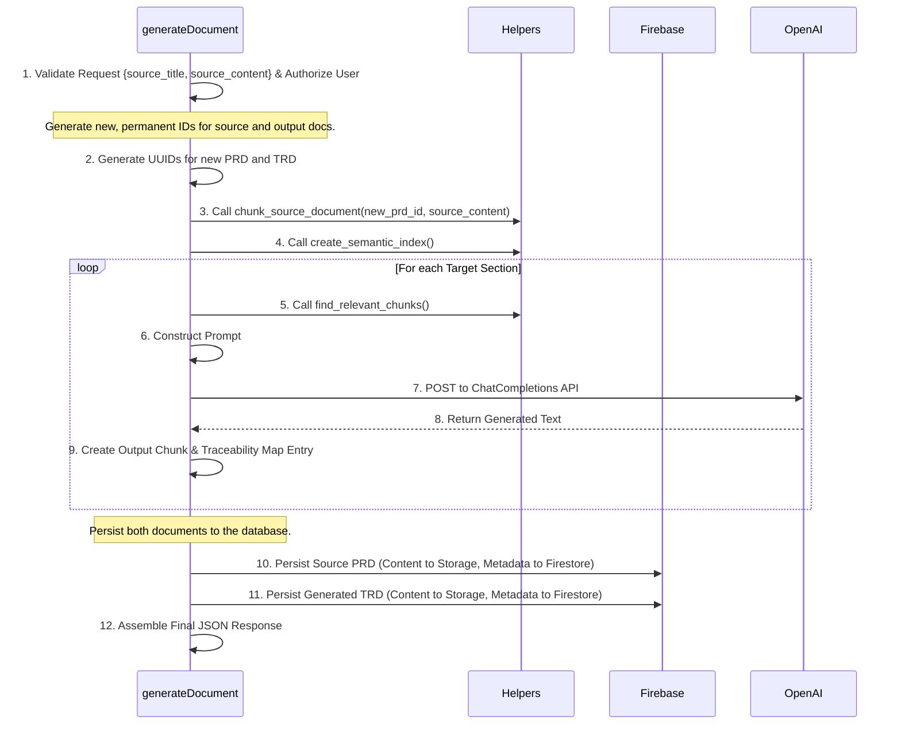

# Detailed TRD - Backend: "Glass Box" v1.1 (On-the-Fly)

| | |
| :--- | :--- |
| **Document ID:** | TRD-BE-01 |
| **Version:** | 1.1 |
| **Status:** | Ready for Development |
| **Author:** | Goose AI (Engineering) |
| **Related TRD:** | TRD-01_Glass_Box.md |

---

### **1. Objective**

This document provides a detailed technical specification for the `generateDocument` Cloud Function, updated to reflect an "on-the-fly" generation model where raw source content is provided. It is intended for the backend developer and contains the necessary detail to implement the feature's server-side logic.

### **2. Core Components & Technologies**

- **Service:** Cloud Functions for Firebase (2nd Gen)
- **Language:** Python 3.11+
- **Primary Libraries:** `firebase-functions`, `firebase-admin`, `sentence-transformers`, `numpy`, `openai`.

### **3. Main Endpoint Orchestration (`generateDocument`)**

The function's core responsibility is now to **receive raw content**, generate a new document, **persist both the source and the output**, and return the result.



### **4. Helper Function Signatures**
The helper functions (`chunk_source_document`, `create_semantic_index`, `find_relevant_chunks`) remain unchanged in their internal logic and signatures. Their role is the same.

### **5. Security & Authorization**
- **Token Verification:** The function must first verify the `Authorization: Bearer <token>` header to authenticate the user. The `uid` from the token will be used as the `authorId` for the newly created documents.
- **Ownership Check:** The concept of checking ownership on an existing document is no longer part of this specific workflow, as we are always creating new documents. Standard Firestore security rules should still be in place to govern read/write access on the `documents` collection.

### **6. Error Handling & Logging**
The error handling table is updated to reflect the new request format.

| Scenario | HTTP Status | Log Level | Log Message |
| :--- | :--- | :--- | :--- |
| Invalid JSON body / Missing required fields | `400` | `INFO` | "Validation failed: Missing source_title or source_content." |
| Firebase Auth token invalid/missing | `401` | `INFO` | "Authentication failed: No valid token." |
| Firebase persistence fails (Storage/Firestore) | `500` | `CRITICAL`| "Failed to persist document: [Error details]" |
| OpenAI API call fails | `503` | `ERROR` | "OpenAI API request failed: [Error details]" |
| Unexpected internal error | `500` | `CRITICAL`| "An unexpected error occurred: [Exception details]" |

---
### **7. API Contract Specification (v1.1)**

This section defines the formal public contract that the `generateDocument` function must adhere to.

#### **Endpoint**
`POST /generateDocument`

#### **Request**
- **Headers:**
    - `Content-Type: application/json` (Required)
    - `Authorization: Bearer <Firebase Auth ID Token>` (Required)
- **Body (`application/json`):**
    ```json
    {
      "source_title": "string",
      "source_content": "string"
    }
    ```
    - **`source_title` (string, required):** The title for the new source document that will be created (e.g., "Q3 Project Phoenix PRD").
    - **`source_content` (string, required):** The full, raw Markdown content of the source document (e.g., the copy-pasted PRD).

#### **Success Response (`200 OK`)**
The success response remains the same, but it's important to note that the `id` fields for both `source_document` and `generated_document` are the **new, permanent IDs** that were created by the backend during this transaction.
- **Body (`application/json`):**
    ```json
    {
      "source_document": {
        "id": "string", // The new ID for the source doc
        "chunks": [
          { "id": "string", "text": "string" }
        ]
      },
      "generated_document": {
        "id": "string", // The new ID for the generated doc
        "chunks": [
          { "id": "string", "text": "string" }
        ]
      },
      "traceability_map": [
        { "output_id": "string", "source_ids": ["string"] }
      ]
    }
    ```

#### **Error Responses**
- **`400 Bad Request`:** Returned for invalid or missing request body fields (`source_title`, `source_content`).
- **`401 Unauthorized`:** Returned for missing or invalid Firebase Auth token.
- **`503 Service Unavailable`:** Returned if the downstream OpenAI service fails.
- **`500 Internal Server Error`:** Returned for any other unexpected backend error, including failures to persist data to Firestore or Storage.
