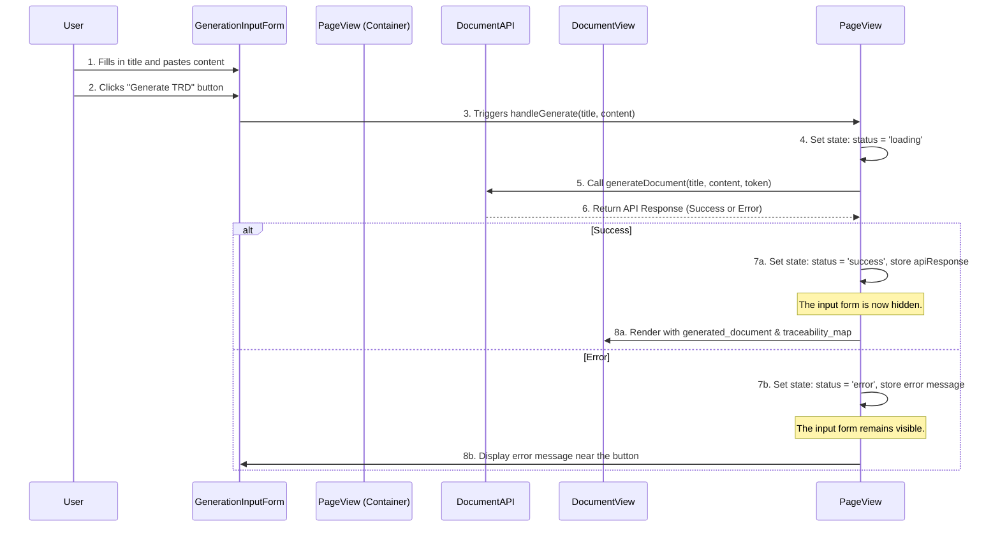

# Detailed TRD - Frontend: "Glass Box" v1.1 (On-the-Fly)

| | |
| :--- | :--- |
| **Document ID:** | TRD-FE-01 |
| **Version:** | 1.1 |
| **Status:** | Ready for Development |
| **Author:** | Goose AI (Engineering) |
| **Related TRD:** | TRD-01_Glass_Box.md, TRD-BE-01_Backend_Implementation.md |

---

### **1. Objective**

This document provides a detailed technical specification for the frontend implementation of the "Glass Box" Traceability Feature, updated for the "on-the-fly" workflow. It outlines the requirements for the UI, API consumption, state management, and user interaction.

### **2. UI Component: `GenerationInputForm`**

A new form component is required to capture the user's input.

-   **Purpose:** To allow users to enter the title and content of the source document.
-   **Components:**
    -   A text input field for `source_title`.
    -   A large `textarea` for `source_content`.
    -   A "Generate TRD" button, which will be disabled until both fields are non-empty.
-   **Events:** The "Generate" button's `onClick` handler will trigger the API call.

### **3. API Service Layer (`documentApi.js`)**

The API service function must be updated to match the new backend contract.

-   **Function Signature:** `async function generateDocument(title: string, content: string, authToken: string): Promise<ApiResponse>`
-   **Logic:**
    1.  This function will make the `POST` request to the `/generateDocument` endpoint.
    2.  It must construct the new JSON body: `{ "source_title": title, "source_content": content }`.
    3.  It must set the required `Content-Type` and `Authorization` headers.
    4.  It must handle success and error responses as before.

### **4. State Management Strategy**

The state object remains largely the same, but the initial trigger is different.

**State Object Structure:**
```typescript
interface DocumentGenerationState {
  status: 'idle' | 'loading' | 'success' | 'error';
  error: string | null;
  // This object is now populated only *after* a successful API call.
  apiResponse: {
    source_document: Document | null;
    generated_document: Document | null;
    traceability_map: Map<string, string[]>; 
  };
  isModalOpen: boolean;
  activeSourceIds: string[];
}
```

### **5. Component Interaction & Logic Flow (Updated)**

The workflow now starts from the input form instead of a document view page.



### **6. Detailed Component Responsibilities (Updated)**

-   **`GenerationPage` (Container Component):**
    -   Owns the `DocumentGenerationState`.
    -   Conditionally renders either the `GenerationInputForm` (if `status` is 'idle' or 'error') or the `DocumentView` (if `status` is 'success'). Renders a loading spinner if `status` is 'loading'.
    -   Contains the `handleGenerate` function that calls the API service.

-   **`DocumentView` & `SourceLinkModal`:**
    -   Their responsibilities remain **unchanged**. They are still presentational components that receive the successful API response data as props and handle the interactive traceability display.

### **7. Frontend Error Handling (Updated)**

The error handling strategy remains the same, but the UI context changes slightly.

| HTTP Status | User-Facing Message (Example) | UI Action |
| :--- | :--- | :--- |
| **400** | "Please ensure both title and content are filled out." | Display the error message directly within the `GenerationInputForm`. |
| **5xx** | "The AI service is currently unavailable. Please try again later." | Display the error message directly within the `GenerationInputForm`. |
| **Network Error**| "Could not connect to the server. Please check your internet connection."| Display the error message directly within the `GenerationInputForm`. |

This updated plan provides the frontend developer with a clear blueprint for building the "on-the-fly" generation feature, ensuring it aligns perfectly with the revised backend API.
