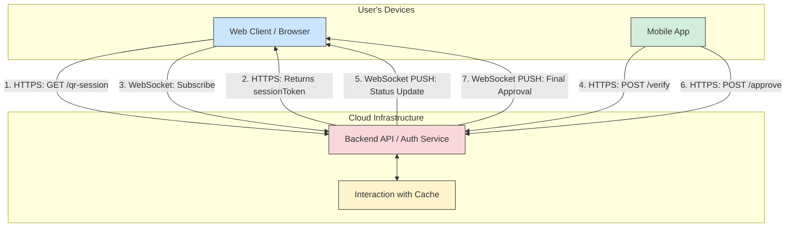
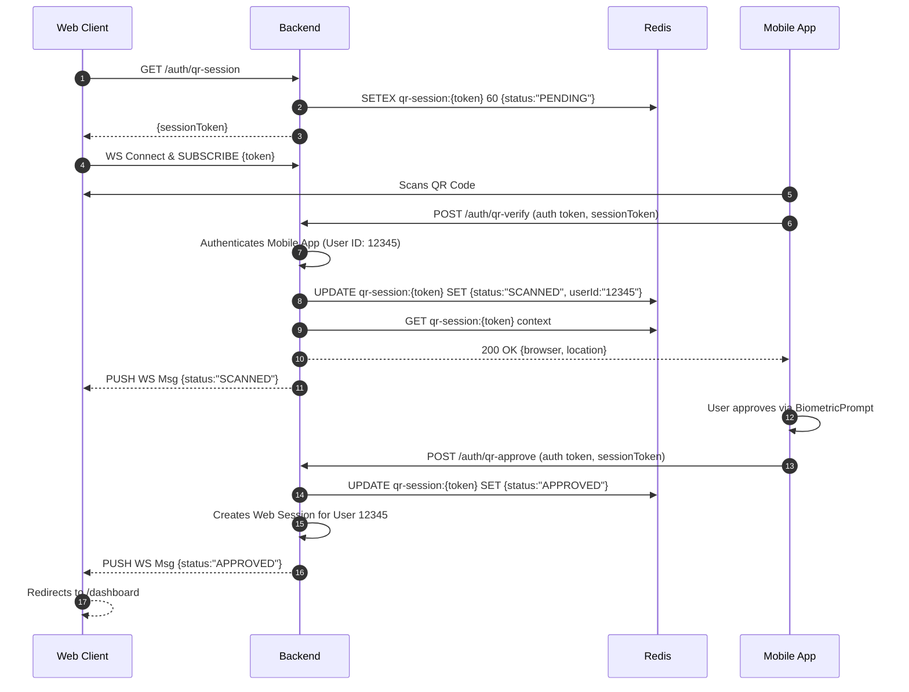

### **Technical Requirements Document: Passwordless QR Authentication (MVP)**

*   **Document Version:** 1.0
*   **Date:** July 23, 2025
*   **Author/Team:** Core Engineering
*   **Related PRD:** `auth-qr-login-v1`

---

### **1. System Architecture Overview**

The system comprises four main components: the Web Client (frontend), the Mobile Client (Android/iOS), the Backend System (API), and a distributed Cache (Redis). Communication occurs over HTTPS and WebSockets.



### **2. Backend System Specifications**

#### **2.1. Technology Stack**
*   **Language/Framework:** Node.js with Express/Fastify OR Go with Gin OR Java/Kotlin with Spring Boot
*   **Cache:** Redis (for storing session state with TTL)
*   **Real-time Communication:** WebSocket library (e.g., `ws` for Node.js, `gorilla/websocket` for Go)

#### **2.2. API Endpoints**

**API Version:** `/api/v1`

**2.2.1. `GET /auth/qr-session`**
*   **Description:** Generates a new, anonymous login session. This is a public endpoint.
*   **Authentication:** None.
*   **Rate Limiting:** MUST be strictly rate-limited per IP (see Security section).
*   **Success Response (200 OK):**
    ```json
    {
      "sessionToken": "a1b2c3d4-e5f6-7890-gh12-i3j4k5l6m7n8"
    }
    ```
*   **Error Response (429 Too Many Requests):** Standard error response when rate limit is exceeded.

**2.2.2. `POST /auth/qr-verify`**
*   **Description:** Called by the authenticated mobile app after scanning a QR code to associate the anonymous session with the user's identity.
*   **Authentication:** Mobile App Bearer Token (JWT).
*   **Request Body:**
    ```json
    {
      "sessionToken": "a1b2c3d4-e5f6-7890-gh12-i3j4k5l6m7n8"
    }
    ```
*   **Success Response (200 OK):** Returns the context of the waiting web browser.
    ```json
    {
      "browser": "Chrome on Windows",
      "location": "Jakarta, Indonesia",
      "verificationExpiresAt": "2025-07-23T12:53:00Z"
    }
    ```
*   **Error Responses:**
    *   **401 Unauthorized:** Invalid mobile auth token.
    *   **404 Not Found:** `sessionToken` does not exist or has expired.

**2.2.3. `POST /auth/qr-approve`**
*   **Description:** Called by the mobile app after the user provides biometric approval. This finalizes the login.
*   **Authentication:** Mobile App Bearer Token (JWT).
*   **Request Body:**
    ```json
    {
      "sessionToken": "a1b2c3d4-e5f6-7890-gh12-i3j4k5l6m7n8"
    }
    ```
*   **Success Response (200 OK):** Empty body. The response confirms the action was received. A secure, HttpOnly cookie will be set on the web browser via the WebSocket connection logic.
*   **Error Responses:**
    *   **401 Unauthorized:** Invalid mobile auth token.
    *   **404 Not Found:** `sessionToken` does not exist or has expired.
    *   **409 Conflict:** Session was already approved or denied.

#### **2.3. WebSocket Events**

**Path:** `/ws/auth`

*   **Client -> Server: `SUBSCRIBE`**
    *   **Description:** The web client sends this message immediately after connecting to the WebSocket to listen for updates on its specific session.
    *   **Payload:**
        ```json
        {
          "command": "subscribe",
          "token": "a1b2c3d4-e5f6-7890-gh12-i3j4k5l6m7n8"
        }
        ```
*   **Server -> Client: `STATUS_UPDATE`**
    *   **Description:** The server pushes this message to the client when the session state changes.
    *   **Payload:**
        ```json
        {
          "event": "status_update",
          "status": "SCANNED" | "APPROVED" | "DENIED" | "EXPIRED"
        }
        ```

#### **2.4. Data Models**

*   **Redis Session State Object:**
    ```json
    {
      "status": "PENDING" | "SCANNED" | "APPROVED" | "DENIED",
      "userId": "12345", // Added after verification
      "webSocketSessionId": "xyz789", // Internal ID of the WebSocket connection
      "browserContext": "Chrome on Windows", // Stored from original /qr-session request
      "ipAddress": "192.0.2.1"
    }
    ```
    *   **Key:** `qr-session:{sessionToken}`
    *   **TTL:** Initial TTL of 60 seconds, extended upon successful scan.

### **3. Web Client (Frontend) Specifications**

*   **Framework:** React, Vue, or Angular.
*   **Libraries:** A WebSocket client library, a QR code rendering library (e.g., `qrcode.react`).
*   **Logic Flow:**
    1.  On "Login with Mobile App" click, call `GET /api/v1/auth/qr-session`.
    2.  Upon receiving the `sessionToken`:
        a.  Render the token as a QR code.
        b.  Start a 60-second visual countdown timer.
        c.  Establish a WebSocket connection to `/ws/auth`.
        d.  Send the `SUBSCRIBE` message with the `sessionToken`.
    3.  Listen for `STATUS_UPDATE` messages from the server.
    4.  If `status` is `SCANNED`, update the UI to "Check your phone...".
    5.  If `status` is `APPROVED`, close the WebSocket and redirect to `/dashboard`.
    6.  If `status` is `DENIED` or `EXPIRED`, show an error and reset the UI.

### **4. Mobile Client (Android) Specifications**

*   **Language:** Kotlin.
*   **Libraries:**
    *   **Camera/QR:** CameraX with `com.google.zxing:core` for analysis.
    *   **Networking:** Retrofit & OkHttp.
    *   **Async:** Kotlin Coroutines.
    *   **Biometrics:** `androidx.biometric.BiometricPrompt`.
*   **Logic Flow:**
    1.  User initiates the QR scanner.
    2.  Launch CameraX with an `ImageAnalysis.Analyzer` configured to use the Zxing `MultiFormatReader`.
    3.  On successful decode, extract the `sessionToken` string.
    4.  Launch a coroutine to call `POST /api/v1/auth/qr-verify` with the token.
    5.  On 200 OK, parse the response body (`browser`, `location`) and display the `ApprovalScreen`.
    6.  When the user taps "Approve", instantiate and show `BiometricPrompt`.
    7.  In the `onAuthenticationSucceeded` callback, call `POST /api/v1/auth/qr-approve`.
    8.  Display success or failure feedback to the user.

### **5. Security Specifications**

*   **Authentication:** The mobile app MUST send a valid JWT Bearer Token in the `Authorization` header for all authenticated endpoints.
*   **Rate Limiting:** The public `/qr-session` endpoint MUST be rate-limited to **15 requests per minute per IP address**. Exceeding this limit MUST return an `HTTP 429` status code.
*   **Transport Security:** All HTTP and WebSocket traffic MUST be over TLS 1.2 or higher (`https://` and `wss://`).
*   **Infrastructure:** The Redis instance MUST be in a private network, inaccessible from the public internet.

### **6. End-to-End Sequence Diagram (Happy Path)**




### **7. Quality Assurance & Test Cases**

This section outlines the test plan for the Passwordless QR Authentication feature. Testing will be conducted across unit, integration, and end-to-end (E2E) levels.

#### **7.1. Web Client (Frontend) Test Cases**

| Test Case ID | Component | Test Scenario | Expected Result | Priority |
| :--- | :--- | :--- | :--- | :--- |
| **WEB-TC-01** | Login Page | Verify that the "Login with Mobile App" button is present, visible, and clickable. | Button is rendered correctly and triggers the QR code flow. | P0 |
| **WEB-TC-02** | QR Generation | Click the login button and verify a QR code is successfully displayed. | A valid QR code image appears on the screen. | P0 |
| **WEB-TC-03** | Timer | Verify the countdown timer is displayed and decreases every second. | Timer counts down from 60 to 0. | P1 |
| **WEB-TC-04** | QR Expiration| Let the timer reach 0. | The QR code becomes invalid (e.g., blurs), and a new code is fetched and displayed automatically. | P1 |
| **WEB-TC-05** | State Change| After a successful scan, verify the UI updates to the "Awaiting Approval" state. | The QR code is replaced with a message like "Check your mobile..." and a loading indicator. | P0 |
| **WEB-TC-06** | Success | After mobile approval, verify the user is redirected to the dashboard. | `window.location` changes to `/dashboard`, and the user is logged in. | P0 |
| **WEB-TC-07** | Denial | After mobile denial, verify an error message is shown. | Page returns to the initial state with a user-friendly error message. | P1 |
| **WEB-TC-08** | Accessibility | Navigate the login page using only the keyboard. | All interactive elements (button, etc.) are focusable and usable. Screen reader announces elements correctly. | P2 |

#### **7.2. Mobile Client (Android) Test Cases**

| Test Case ID | Component | Test Scenario | Expected Result | Priority |
| :--- | :--- | :--- | :--- | :--- |
| **MOB-TC-01**| QR Scanner | Open the scanner and point it at a valid QR code. | The scanner recognizes the code quickly (< 2 seconds) and proceeds to the next step. | P0 |
| **MOB-TC-02**| Approval UI | After a scan, verify all context elements are displayed on the approval screen. | Screen correctly shows Browser, OS, and approximate Location. "Approve" and "Deny" buttons are visible. | P0 |
| **MOB-TC-03**| Biometrics | Tap "Approve" and complete the biometric prompt successfully. | The app sends the approval request to the backend. | P0 |
| **MOB-TC-04**| Biometrics Cancel| Tap "Approve" but cancel the biometric prompt. | The approval request is NOT sent. The user remains on the approval screen. | P1 |
| **MOB-TC-05**| Invalid QR | Scan a QR code from a different application or an invalid string. | The scanner ignores the code, or the app displays an "Invalid QR Code" error after verification fails. | P1 |
| **MOB-TC-06**| Expired QR | Scan a QR code after its 60-second TTL has passed on the web. | The app displays an error message: "This QR code has expired." | P1 |
| **MOB-TC-07**| Network Loss | Attempt to verify a QR code while the device is in airplane mode. | App displays a "No network connection" error. | P2 |
| **MOB-TC-08**| Deny Flow | On the approval screen, tap the "Deny" button. | The app sends the denial request to the backend and returns to its previous state (e.g., dashboard). | P1 |

#### **7.3. Backend API (Integration Tests)**

| Test Case ID | Endpoint | Test Scenario | Expected Result | Priority |
| :--- | :--- | :--- | :--- | :--- |
| **BE-TC-01** | `GET /auth/qr-session` | Make a valid request to the endpoint. | Receive a 200 OK response with a `sessionToken`. | P0 |
| **BE-TC-02** | `GET /auth/qr-session` | Send 20 requests in 1 minute from the same IP. | The first 15 requests succeed; the subsequent ones receive a 429 Too Many Requests error. | P1 |
| **BE-TC-03** | `POST /auth/qr-verify` | Send a valid, authenticated request with an active `sessionToken`. | Receive a 200 OK response. The session status in Redis is updated to "SCANNED" with the correct `userId`. | P0 |
| **BE-TC-04** | `POST /auth/qr-verify` | Send a request with an invalid mobile authentication token. | Receive a 401 Unauthorized error. | P1 |
| **BE-TC-05** | `POST /auth/qr-verify` | Send a request with a `sessionToken` that does not exist or has expired. | Receive a 404 Not Found error. | P1 |
| **BE-TC-06** | `POST /auth/qr-approve`| Send a valid, authenticated request for a "SCANNED" session. | Receive a 200 OK response. Session status becomes "APPROVED". A WebSocket push is triggered. | P0 |
| **BE-TC-07** | `POST /auth/qr-approve`| Try to approve a session that is still "PENDING" (not scanned yet). | Receive a 409 Conflict error. | P2 |
| **BE-TC-08** | `POST /auth/qr-approve`| Try to approve a session that has already been approved or denied. | Receive a 409 Conflict error. | P2 |

#### **7.4. End-to-End (E2E) Scenarios**

| Test Case ID | Scenario | Steps | Expected Result | Priority |
| :--- | :--- | :--- | :--- | :--- |
| **E2E-TC-01**| **Happy Path** | 1. User clicks login on web. 2. Scans QR with mobile. 3. Sees correct context. 4. Approves with biometrics. | User is seamlessly logged into the web dashboard. | P0 |
| **E2E-TC-02**| **User Denial** | 1. User clicks login on web. 2. Scans QR. 3. Taps "Deny" on the mobile approval screen. | Web client shows an error message and returns to the login page. User is not logged in. | P1 |
| **E2E-TC-03**| **Web Timeout**| 1. User gets a QR code on the web. 2. Waits >60 seconds. 3. The QR code refreshes on the screen. | The old QR code is no longer valid. The new QR code can be scanned successfully. | P1 |
| **E2E-TC-04**| **Mobile Timeout**| 1. User scans a QR code. 2. Waits >60 seconds on the mobile approval screen. 3. Taps "Approve". | The mobile app shows an error because the session has expired on the backend. The web client also times out. | P2 |

#### **7.5. Non-Functional Testing**

| Test Case ID | Area | Test Scenario | Expected Result | Priority |
| :--- | :--- | :--- | :--- | :--- |
| **SEC-TC-01**| **Authentication**| Use a tool (e.g., Postman) to call `/auth/qr-verify` without a valid JWT. | Request is rejected with a 401 Unauthorized status. | P0 |
| **SEC-TC-02**| **Session Security**| After a successful login, inspect the session cookie set on the browser. | The cookie MUST have the `HttpOnly` and `Secure` flags set. | P1 |
| **PERF-TC-01**| **Load Test** | Use a tool (e.g., k6, Gatling) to simulate 200 concurrent users attempting the QR login flow over a 1-minute period. | API response times remain <500ms. End-to-end login success rate remains >99%. Server CPU and memory usage stay within acceptable limits. | P2 |